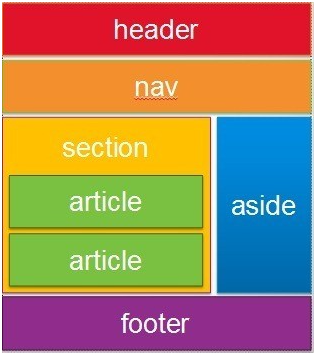
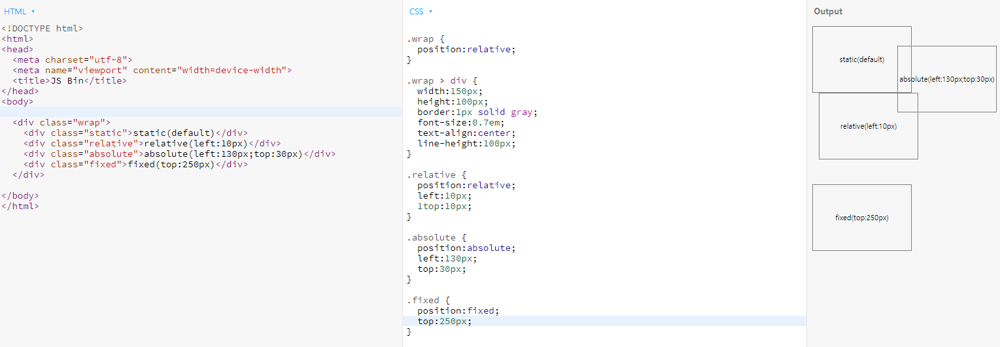
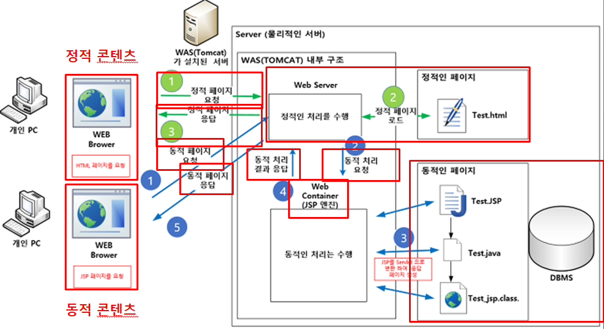
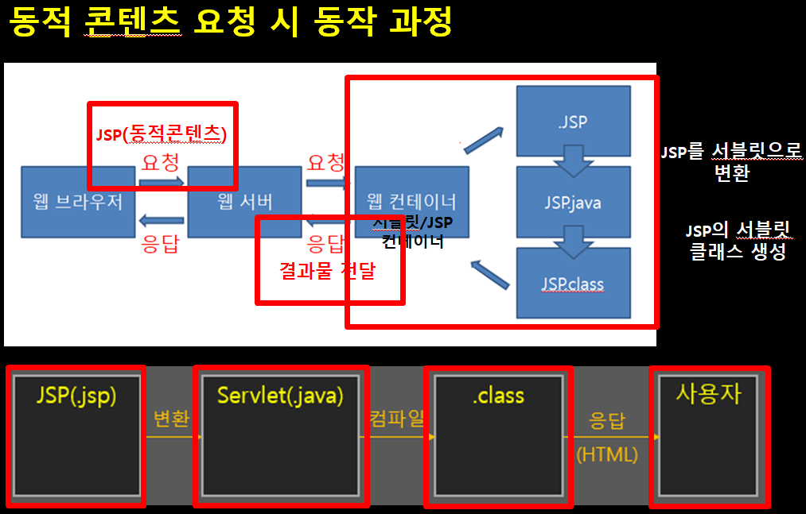
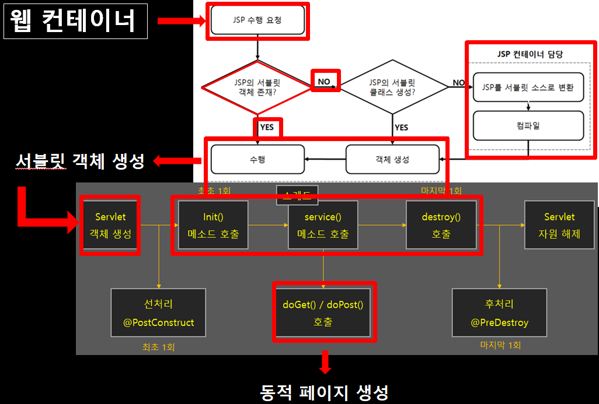
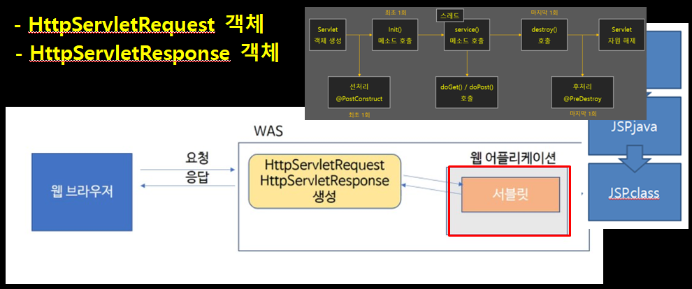
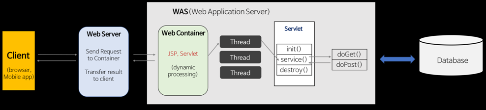
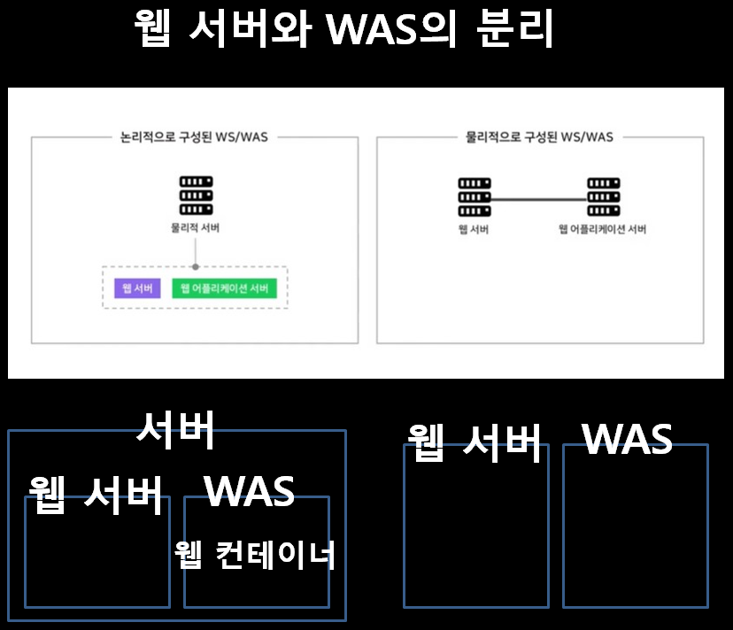
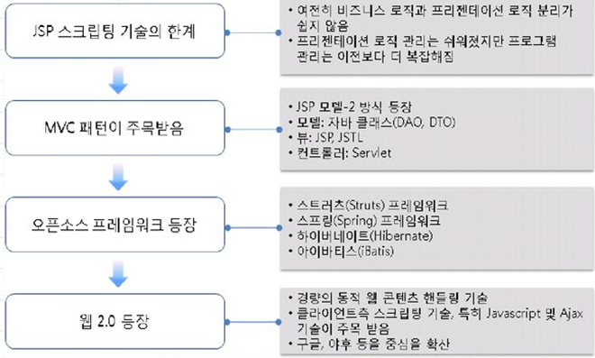

### [마크다운 문법](https://markdown-it.github.io/)

## 1. Web개발의 이해

- **프로그래밍 언어**

    저급언어 <-> 고급언어

    기계어(2진수) <- 컴파일러 -> 어셈블리어(기호) 프로그래밍언어

- **HPPT 프로토콜**

    서버와 클라이언트가 인터넷상에서 데이터를 주고 받기 위한 통신규약
    
    client가 request하면 server는 response한다. (get, post, put 방식으로)

    | 이름 | 프로토콜 | 포트 | 기능 |
    | ----- | ----- | ----- | ----- |
    | WWW   | HTTP  | 80    | 웹서비스 |
    | Email | SMTP/POP3/IMAP| 25/110/114| 이메일 서비스 |
    | FTP   | FTP   | 21    | 파일 전송 서비스
    | DNS   |TCP/UDP| 53    | 네임서비스
    | NEWS  | NNTP  | 119   | 인터넷 뉴스 서비스

- **browser의 동작**

    **파싱(해석) -> 렌더링(표현)**

    렌더링 엔진의 예시: 사파리는 WebKit, 크롬은 크로니움(= Blink(WebKit에서 fork됨)+ V8)

    HTML을 토큰 단위로 '파싱'해서 'DOM트리'를 만들고,
    
    CSS를 토큰 단위로 '파싱'해서 '스타일 규칙'을 만든다.

    두 가지를 조합해서 '렌더트리'를 생성해서 배치하고 화면에 그린다.

- **browser에서의 웹개발**

    JavaScript코드는 body태그가 닫히기 전에 위치하는 것이 렌더링을 방해하지 않아서 좋고,

    css코드는 head태그 안에 위치해서 렌더링 처리 시에 브라우저가 더 빨리 참고할 수 있게 하는 것이 좋다.

- **웹서버**

    소프트웨어가 동작하는 __컴퓨터__

    클라이언트(브라우저, 크롤러robots.txt)가 요청하는 리소스에 응답한다.

    가장 많이 사용하는 웹 서버는 Apache, Nginx, Microsoft IIS 가 있다.

- **WAS**

    동적 데이터를 처리하기 위한 미들웨어

    예시로 Tomcat이 있다.

    만약 톰캣이 다운되면, 아파치를 앞단에 두고 해당 톰캣에 접근하지 못하게 하는 방법이 있다.


## 2. HTML

- **레이아웃**
    
    


## 3. CSS

- **CSS 선언방법**

    css의 구성
    span: {color:red;}

    span: selector(선택자),
    color: property,
    red: value

- **상속과 우선순위 결정**

    box-model이라고 불리는 속성들(width, height, margin, padding, border)과 같이 크기와 배치 관련된 속성들은 하위엘리먼트로 상속이 되지 않습니다.

- **CSS selector**

    공백: 자손요소
    아래 모든 span태그에 red색상이 적용됨
    ```
    <div id="jisu">
    <div>
        <span> span tag </span>
    </div>
    <span> span tag 2 </span>
    </div>
    #jisu span { color : red }
    ```

    자식 선택 (>) : 자식은 바로 하위엘리먼트를 가리킵니다.

    아래는 span tag 2만 red 색상이 적용됩니다.
    ```
    <div id="jisu">
    <div>
        <span> span tag </span>
    </div>
    <span> span tag 2 </span>
    </div>
    #jisu > span { color : red }
    ```

    nth-child와 nth-of-type

    p:nth-child(2): 부모의 모든 자식 중 2번째 -> 첫번째 단락입니다

    p:nth-of-type(2): 부모의 자식 중 p태그인 것의 2번째 -> 두번째 단락입니다
    ```
    <div id="jisu">
        <h2>단락 선택</h2>
        <p>첫번째 단락입니다</p>
        <p>두번째 단락입니다</p>
        <p>세번째 단락입니다</p>
        <p>네번째 단락입니다</p>
    </div>
    #jisu > p:nth-child(2) { color : red }
    ```

- **CSS 기본 Style 변경하기**
    
    font-size : 1em; (16px 기준)
    
    font-size : 16px;

    벡터 방식의 아이콘 웹폰트도 있으며, unicode영역 중 Private Use Area(PUA)영역을 활용해 제작한 것이다.

- **엘리먼트가 배치되는 방식**

    ```
    display(block, inline, inline-block)
    position(static, absolute, relative, fixed)
    float(left, right)
    ```

    [예제 코드](https://jsbin.com/nemuvitola/edit?html,css,output)

    1. position 속성으로 특별한 배치를 할 수 있습니다.

        position 속성은 기본 static입니다.

        그냥 순서대로 배치됩니다.

    2. absolute는 기준점에 따라서 특별한 위치에 위치합니다.

        top / left / right / bottom 으로 설정합니다.

        기준점을 상위엘리먼트로 단계적으로 찾아가는데 static이 아닌 position이 기준점입니다. (.wrap>div 가 아니라 .wrap의 position:relative 기준)

    3. relative는 원래 자신이 위치해야 할 곳을 기준으로 이동합니다.

        top / left / right / bottom로 설정합니다.    

    4. fixed는 viewport(전체화면) 좌측, 맨 위를 기준으로 동작합니다.    

        스크롤해도 위치 그대로 (ex광고)

        


- box-sizing 속성을 border-box로 설정하면 엘리먼트의 크기를 고정하면서 padding 값만 늘릴 수 있습니다.
    [예제 코드](https://jsbin.com/pediferawu/edit?html,css,output)

## 4. Servlet

- **Servlet 이란?**

    자바 웹 어플리케이션의 구성요소 중 __동적인__ 처리를 하는 프로그램

    __WAS__에서 동작하는 JAVA 클래스

    HttpServlet 클래스를 상속받아야 한다.







- **기타**




- 클라이언트에서 동적 데이터를 요청하면
- WAS에서 HttpServlet객체를 생성한다.
- 웹 컨테이너 내부에서 jsp는 servlet으로 컴파일 된다.
- servlet의 service()(doGet(), doPost()) 메서드로 동적 페이지를 생성하고
- 결과값을 HttpServletReponse에 담아 
- WAS -> 웹 서버 -> 클라이언트 로 전달한다.

## 5. css 작업 Tip
- 태그 작업 시 백그라운드컬러를 주고 작업하기
- 태그가 가진 기본 속성 이해하기 -> 없애고 작업하는 것이 편해 reset.css nomalize.css 등을 활용한다
- 브라우저마다 css가 다르게 보임을 이해하기 
- float대신에 flex박스 활용하기 (ms는 pre-fix)
- 처음에 큰 그림을 손으로 그린다고 생각하고 만들기
- inline block에 주의하기
- button이 여러개 이면 div로 묶어주기
- 개체 추가를 염두해두기 (id="id_wrap" 이 정도만 쓰고 나머지는 보통 class를 써준다)
- global.css를 두고 페이지별로 css를 쓰거나 class명을 줘서 구분하기
- SCSS는 css로 컴파일해서 사용하기
- var은 전역변수로 잘 쓰지 않고, const나 let을 사용한다. (scope를 생각하며 코드를 작성하자
- 박스를 만들 때는 width, height로 고정시키기 (그렇지 않으면 텍스트에 따라 상자 크기가 달라진다)
- hr태그와 br태그는 자제하기 (p태그와 같은 태그를 사용하며 css 속성으로 대체하기)
- line-height 인라인 박스의 높이 지정하기